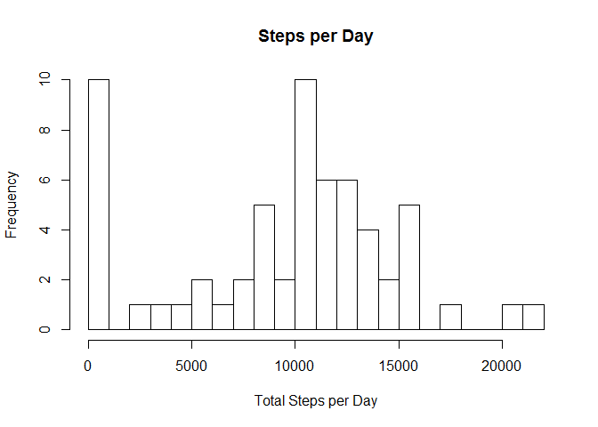
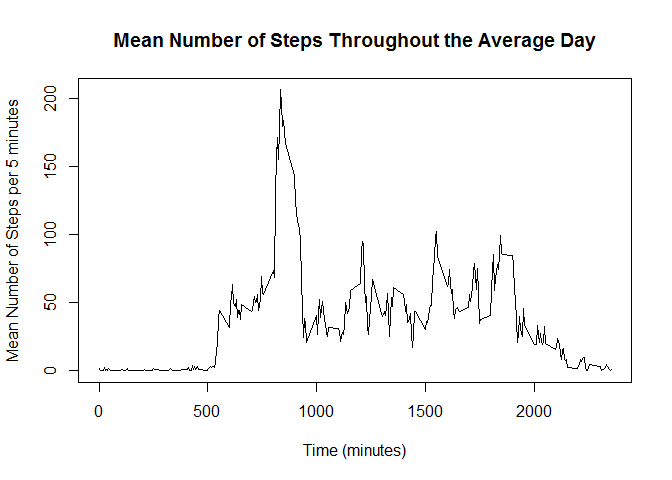

# Reproducible Research: Peer Assessment 1


## Loading and preprocessing the data

I have used read.csv to read the activity data and assign the steps and intervals values as numeric class and dates as Date class.


```r
data <- read.csv("activity.csv", colClasses = c("numeric", "Date", "numeric"), na.strings = "NA")
```

## What is mean total number of steps taken per day?

First I constructed a histogram of total steps by date (removing NAs).

```r
steps_per_date <- tapply(data$steps, data$date, sum, na.rm=TRUE)
hist(steps_per_date, breaks = 20, xlab = "Total Steps per Day", main = "Steps per Day")
```

<!-- -->

Then I calculated the mean:

```r
mean(steps_per_date)
```

```
## [1] 9354.23
```

and median:

```r
median(steps_per_date)
```

```
## [1] 10395
```

## What is the average daily activity pattern?

First I constructed a time series plot of the average number of steps measured for each 5-minute time interval.

```r
meansteps_per_int <- tapply(data$steps, data$interval, mean, na.rm=TRUE)
plot(row.names(meansteps_per_int), meansteps_per_int, type="l",xlab="Time (minutes)", ylab="Mean Number of Steps per 5 minutes", main="Mean Number of Steps Throughout the Average Day")
```

<!-- -->

From the plot it appears that the maximum mean number of steps in an interval is about 200 at about the 800th interval. To find the exact interval with the highest average number of steps I did the following:

```r
meansteps_per_int[which.max(meansteps_per_int)]
```

```
##      835 
## 206.1698
```

So the 835th time interval had the maximum mean number of steps (~206.2 steps).

## Imputing missing values

The total number of missing values was calculated:

```r
sum(is.na(data))
```

```
## [1] 2304
```

My strategy for replacing the missing values is to replace them with the mean value for that interval.

```r
newdata <- data
missing <- is.na(newdata$steps)
interval_mean <- tapply(data$steps, data$interval, mean, na.rm = TRUE)
newdata$steps[missing] <- interval_mean[as.character(newdata$interval[missing])]
```

Then using the new data set with imputed values a histogram and mean and median values were calculated.

```r
new_steps_per_date <- tapply(newdata$steps, newdata$date, sum, na.rm=TRUE)
hist(new_steps_per_date, breaks = 20, xlab = "Total Steps per Day", main = "Steps per Day (with imputed values)")
```

<!-- -->


```r
mean(new_steps_per_date)
```

```
## [1] 10766.19
```


```r
median(new_steps_per_date)
```

```
## [1] 10766.19
```

These values are different from those calculated earlier. Inserting the mean values for each interval has increased the mean and median as previously the missing values were effectively zeros when summing over the total steps per day.
By looking at the two histograms we can see that days that previously had few or zero steps recorded are now recorded as having the average number of steps.

## Are there differences in activity patterns between weekdays and weekends?

A new column was added to the data set with imputed values to indicate whether a day was a weekday or a weekend.

```r
newdata$daytype <- as.factor(ifelse(weekdays(newdata$date) == "Saturday" | weekdays(newdata$date) == "Sunday", "weekend", "weekday"))
```

Lastly I constructed a Time Series plot comparing weekdays and weekends.

```r
steps_per_date_daytype <- aggregate(steps ~ daytype + interval, data = newdata, FUN=mean)
library(lattice)
xyplot(steps ~ interval | factor(daytype), layout = c(1, 2), xlab = "Time (minutes)", ylab = "Mean Number of Steps per 5 minutes", main = "Steps per Day by Day Type (with imputed values)", type="l", data = steps_per_date_daytype)
```

<!-- -->

We can see that activity on weekdays starts earlier and peaks in the morning. On weekends, activity is spread throughout the day.
